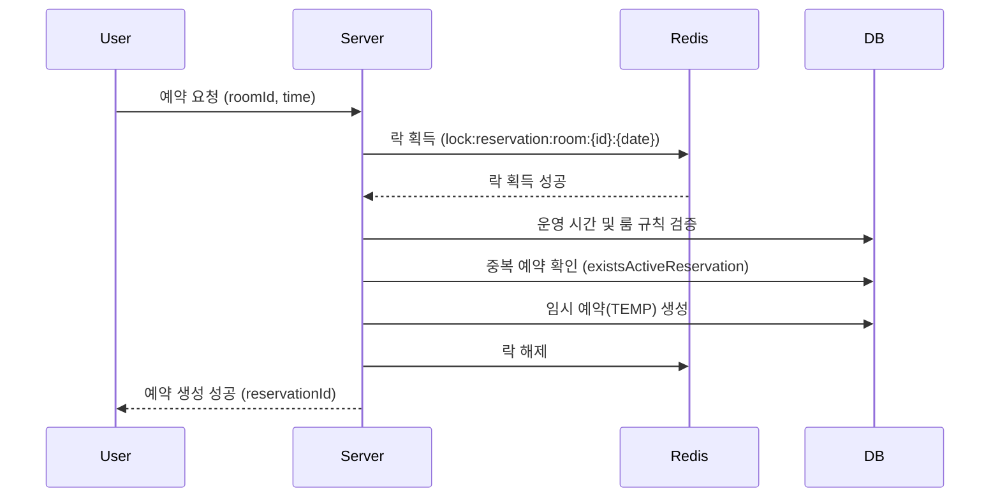
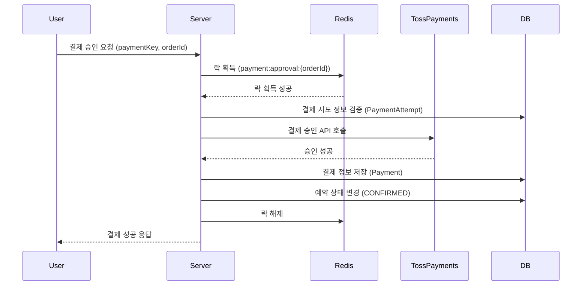

# StudyRoomReservation

스터디룸 예약 시스템 프로젝트입니다.

## 프로젝트 개요

이 프로젝트는 사용자가 스터디룸을 검색하고 예약하며, 결제 및 환불을 진행할 수 있는 웹 애플리케이션입니다. 관리자는 스터디룸, 예약, 환불 정책 등을 관리할 수 있습니다.

## 프로젝트 구조

```
src/main/java/com/example/studyroomreservation
├── domain
│   ├── member       # 회원 도메인
│   ├── room         # 스터디룸 도메인
│   ├── reservation  # 예약 도메인
│   ├── payment      # 결제 도메인
│   └── refund       # 환불 도메인
├── global           # 전역 설정 및 공통 유틸리티
│   ├── aop          # AOP 관련 (분산 락, 로깅)
│   ├── config       # 설정 파일 (Security, QueryDSL, P6Spy 등)
│   ├── exception    # 전역 예외 처리 (ErrorCode, ExceptionHandler)
│   ├── security     # Spring Security 설정 및 필터
│   └── util         # 공통 유틸리티 클래스
└── StudyRoomReservationApplication.java
```

## 주요 기능

### 1. 회원 (Member)
- **회원가입 및 로그인**: 사용자는 회원가입을 통해 계정을 생성하고 로그인할 수 있습니다.
- **마이페이지**: 내 정보 조회 및 예약 내역 확인이 가능합니다.

### 2. 스터디룸 (Room)
- **스터디룸 목록 조회**: 사용자는 다양한 조건(수용 인원, 편의시설 등)으로 스터디룸을 검색하고 정렬할 수 있습니다.
- **스터디룸 상세 조회**: 특정 스터디룸의 상세 정보를 확인할 수 있습니다.
- **관리자 기능**: 관리자는 스터디룸을 등록, 수정, 삭제할 수 있으며 운영 정책을 설정할 수 있습니다.

### 3. 예약 (Reservation)
- **예약 신청**: 사용자는 원하는 스터디룸을 선택하여 예약을 진행할 수 있습니다.
- **예약 내역 조회**: 사용자는 자신의 예약 내역(진행 중, 지난 예약)을 확인할 수 있습니다.
- **예약 취소**: 예약 상세 페이지에서 예약을 취소할 수 있습니다.
- **관리자 기능**: 관리자는 전체 예약 현황을 조회하고 관리할 수 있습니다.

### 4. 결제 (Payment)
- **결제 진행**: 예약 시 결제 시스템을 통해 결제를 진행합니다.
- **결제 승인 및 실패 처리**: 결제 승인 및 실패에 대한 처리를 수행합니다.

### 5. 환불 (Refund)
- **환불 정책 관리**: 관리자는 환불 정책(환불율, 적용 기준 등)을 등록하고 관리할 수 있습니다.
- **환불 계산**: 예약 취소 시 적용된 환불 정책에 따라 환불 금액을 자동으로 계산합니다.

## 기술 스택

- **Language**: Java 21
- **Framework**: Spring Boot 3.5.9
- **Build Tool**: Gradle
- **Database**: MySQL, Redis
- **ORM**: JPA (Hibernate), QueryDSL
- **Template Engine**: Thymeleaf
- **Security**: Spring Security
- **API Documentation**: SpringDoc OpenAPI (Swagger)
- **Utils**: Lombok, MapStruct, Thumbnailator, Apache Tika, P6Spy

## 실행 방법

1.  프로젝트를 클론합니다.
2.  `application.yml` 또는 `.env` 파일에 필요한 환경 변수(DB 설정 등)를 구성합니다.
3.  `./gradlew bootRun` 명령어로 애플리케이션을 실행합니다.
4.  브라우저에서 `http://localhost:8080`으로 접속합니다.

## API 문서

서버 실행 후 아래 주소에서 API 명세를 확인할 수 있습니다.
- **Swagger UI**: `http://localhost:8080/swagger-ui/index.html`

## 프로젝트 핵심 특징 (Key Highlights)

### 1. 분산 락(Distributed Lock)을 활용한 동시성 제어
- **문제 해결**: 예약 및 결제 과정에서 발생할 수 있는 중복 요청 및 경쟁 조건(Race Condition)을 해결하기 위해 Redis 기반의 분산 락을 도입했습니다.
- **AOP 적용**: `@DistributedLock` 어노테이션을 직접 구현하여 비즈니스 로직과 락 처리 로직을 분리, 코드의 가독성과 재사용성을 높였습니다.

### 2. 안정적인 결제 프로세스
- **검증 분리**: 결제 승인 요청 시, PG사 호출 전후로 철저한 데이터 검증을 수행합니다.
- **트랜잭션 관리**: 외부 API(Toss Payments) 호출과 DB 저장 로직의 트랜잭션을 분리하여, 외부 서비스 장애가 내부 데이터 무결성에 영향을 주지 않도록 설계했습니다.

### 3. 유연한 환불 정책 시스템
- **정책 커스터마이징**: 관리자가 다양한 환불 정책(취소 시점에 따른 환불율 등)을 설정할 수 있습니다.
- **자동 계산**: 예약 취소 시, 예약된 스터디룸에 적용된 정책을 기반으로 환불 금액을 자동으로 계산하여 휴먼 에러를 방지합니다.

### 4. QueryDSL을 이용한 동적 쿼리
- **타입 안전성**: 복잡한 검색 조건(스터디룸 필터링, 예약 내역 조회 등)을 QueryDSL로 구현하여 컴파일 시점에 쿼리 오류를 잡을 수 있습니다.
- **성능 최적화**: 필요한 데이터만 조회하는 프로젝션과 페이징 처리를 통해 조회 성능을 최적화했습니다.

## 개발 컨벤션 (Conventions)

### 1. 패키지 구조 (Package Structure)
도메인 주도 설계(DDD)를 반영하여 도메인별로 패키지를 구성했습니다.
- `domain/{domain_name}/controller`: 웹 요청 처리
- `domain/{domain_name}/service`: 비즈니스 로직
- `domain/{domain_name}/repository`: 데이터 접근
- `domain/{domain_name}/entity`: 도메인 엔티티
- `domain/{domain_name}/dto`: 데이터 전송 객체

### 2. 네이밍 규칙 (Naming Rules)
- **DTO**: 역할과 계층을 명확히 하기 위해 `{Domain}{Action}Request`, `{Domain}{Action}Response` 형식을 따릅니다.
- **URL Mapping**: 컨트롤러의 URL 경로는 별도의 `Constants` 클래스(예: `RoomConstants`)에서 상수로 관리하여 유지보수성을 높였습니다.

### 3. 예외 처리 (Exception Handling)
- **Custom Exception**: `BusinessException`을 상속받아 비즈니스 로직에서 발생하는 예외를 처리합니다.
- **Error Code**: `ErrorCode` Enum을 사용하여 에러 메시지와 상태 코드를 일관성 있게 관리합니다.

### 4. 객체 매핑 (Object Mapping)
- **MapStruct**: Entity와 DTO 간의 변환은 `MapStruct` 라이브러리를 사용하여 반복적인 코드를 줄이고 매핑 로직을 명확하게 관리합니다.

## 협업 및 개발 프로세스 (Collaboration Process)

팀원 간의 원활한 소통과 코드 품질 향상을 위해 다음과 같은 개발 프로세스를 준수했습니다.

### 1. 브랜치 전략 (Branch Strategy)
- **Gitflow** 전략을 기반으로 운영했습니다.
- **Branch Naming**: 이슈 트래킹을 위해 이슈 번호를 포함하여 브랜치를 생성했습니다.
    - 예: `feature/#12-reservation-api`

### 2. 커밋 컨벤션 (Commit Convention)
- 작업 내용을 명확히 파악할 수 있도록 **Conventional Commits** 규칙을 따랐습니다.
- 구조: `type: subject`
    - 예: `feat: 예약 취소 기능 구현`, `fix: 결제 검증 로직 수정`

### 3. 코드 리뷰 및 머지 (Code Review & Merge)
- **Merge Request (MR)**를 통해 코드 리뷰를 진행했습니다.
- **리뷰 프로세스**:
    1. MR 생성 시 작업 내용과 변경 사항을 상세히 기술합니다.
    2. 리뷰어는 댓글 스레드(Thread)를 열어 질문하거나 피드백을 남깁니다.
    3. 작성자는 답변을 달고 코드를 수정한 뒤 스레드를 해결(Resolve)합니다.
    4. **모든 스레드가 해결되고, 팀원들의 승인(Approve)을 받아야만 머지**할 수 있도록 제한했습니다.
- **목적**: 단순한 코드 오류 발견을 넘어, 프로젝트 전반에 대한 **팀원 간의 이해도를 동기화**하고, 심도 있는 리뷰를 통해 안정적인 서비스를 개발하고자 했습니다.

## 예약 및 결제 프로세스 흐름

### 예약 생성 (Reservation Creation)
사용자가 예약을 요청하면, 해당 스터디룸과 시간에 대한 락을 획득하여 중복 예약을 방지합니다.



### 결제 승인 (Payment Approval)
결제 승인 시에도 중복 처리를 방지하기 위해 주문 ID(orderId) 기반의 분산 락을 사용합니다.



#### 결제 승인 프로세스 설계 의도 (Design Decisions)

**1. 외부 API 호출을 분산 락 내부에 포함한 이유**
- **목적**: **중복 결제 방지 (Idempotency)**
- **설명**: 만약 락 없이 API를 호출한다면, 사용자의 중복 클릭 등으로 인해 동시에 여러 요청이 PG사로 전송될 수 있습니다. 이는 이중 결제라는 심각한 문제를 초래하므로, **한 번에 하나의 요청만 PG사 승인 API에 접근**하도록 락 범위 안에 외부 API 호출을 포함시켰습니다.

**2. 트랜잭션 범위를 DB 저장 로직으로 축소한 이유**
- **목적**: **DB 커넥션 효율성 및 성능 최적화**
- **설명**: 외부 API(Toss Payments) 호출은 네트워크 상황에 따라 지연될 수 있습니다. 만약 전체 메서드를 `@Transactional`로 묶는다면, API 응답을 기다리는 동안 DB 커넥션을 계속 점유하게 되어 전체 시스템의 처리량을 저하시킵니다. 따라서 **API 호출은 트랜잭션 밖에서 수행**하고, 결제 정보를 저장하는 `appendPayment` 메서드에만 트랜잭션을 적용했습니다.

**3. 타임아웃(TTL) 설정 이유**
- **목적**: **Deadlock 방지 및 데이터 무결성**
- **설명**:
    - **Lock Lease Time**: 서버 장애 등으로 락이 해제되지 않는 경우를 대비해 일정 시간이 지나면 자동으로 락을 해제하여 다른 요청이 처리될 수 있도록 했습니다.
    - **Payment Attempt TTL**: 결제 시도(`PaymentAttempt`) 생성 후 너무 오랜 시간이 지난 요청은 보안상 유효하지 않은 것으로 간주하여 거절합니다.


