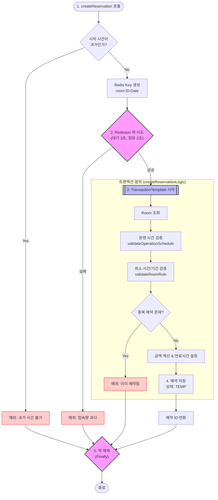

```mermaid
flowchart TD
    %% 노드 스타일 정의
    classDef lock fill:#f9f,stroke:#333,stroke-width:2px;
    classDef trans fill:#bbf,stroke:#333,stroke-width:2px;
    classDef fail fill:#ffcccc,stroke:#f00;

    Start([1. createReservation 호출]) --> TimeCheck{"시작 시간이<br/>과거인가?"}
    TimeCheck -- Yes --> Ex1["예외: 과거 시간 불가"]:::fail
    TimeCheck -- No --> GenKey["Redis Key 생성<br/>room:ID:Date"]
    
    GenKey --> TryLock{"2. Redisson 락 시도<br/>(대기 3초, 점유 2초)"}:::lock
    TryLock -- 실패 --> Ex2["예외: 접속량 과다"]:::fail
    
    TryLock -- 성공 --> Template[["3. TransactionTemplate 시작"]]:::trans
    
    subgraph "트랜잭션 범위 (createReservationLogic)"
        Template --> GetRoom["Room 조회"]
        GetRoom --> Valid1["운영 시간 검증<br/>validateOperationSchedule"]
        Valid1 --> Valid2["최소 시간/기간 검증<br/>validateRoomRule"]
        Valid2 --> DupCheck{"중복 예약 존재?"}
        
        DupCheck -- Yes --> Ex3["예외: 이미 예약됨"]:::fail
        DupCheck -- No --> Calc["금액 계산 & 만료시간 설정"]
        Calc --> Save["4. 예약 저장<br/>상태: TEMP"]
    end
    
    Save --> Return["예약 ID 반환"]
    Return --> Unlock{"5. 락 해제<br/>(Finally)"}:::lock
    Ex1 & Ex2 & Ex3 --> Unlock
    Unlock --> End([종료])
```

